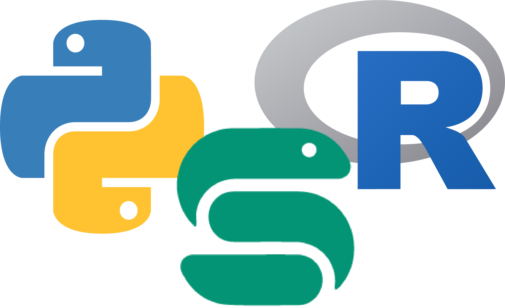

# just-enough-python

Just enough Python for R users to write advanced Snakemake workflows.

We covered the main "Just Enough Python" tutorial in two 1-hour code club sessions. View the content here: <https://www.schlosslab.org/just-enough-python/index.html>

[^1]

[^1]: The [Python logo](https://commons.wikimedia.org/wiki/File:Python-logo-notext.svg) by the Python Software Foundation is licensed under GNU GPL v2. The [Snakemake logo](https://commons.wikimedia.org/wiki/File:Snakemake_logo_dark.png) by Johannes Köster is  licensed under CC BY-SA 4.0. The [R logo](https://commons.wikimedia.org/wiki/File:R_logo.svg) by Hadley Wickham and others at RStudio is licensed under CC BY-SA 4.0.The [Python logo](https://commons.wikimedia.org/wiki/File:Python-logo-notext.svg) by the Python Software Foundation is licensed under GNU GPL v2. The [Snakemake logo](https://commons.wikimedia.org/wiki/File:Snakemake_logo_dark.png) by Johannes Köster is  licensed under CC BY-SA 4.0. The [R logo](https://commons.wikimedia.org/wiki/File:R_logo.svg) by Hadley Wickham and others at RStudio is licensed under CC BY-SA 4.0.
